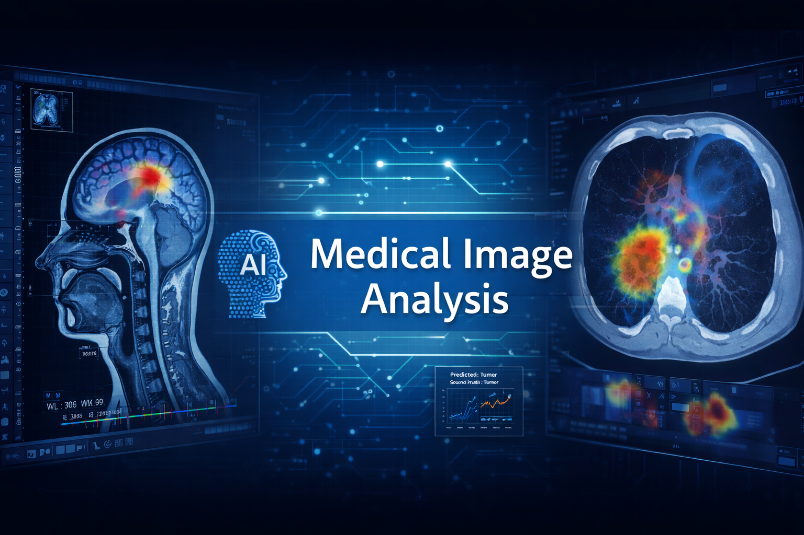
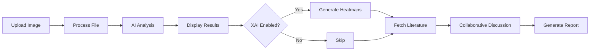
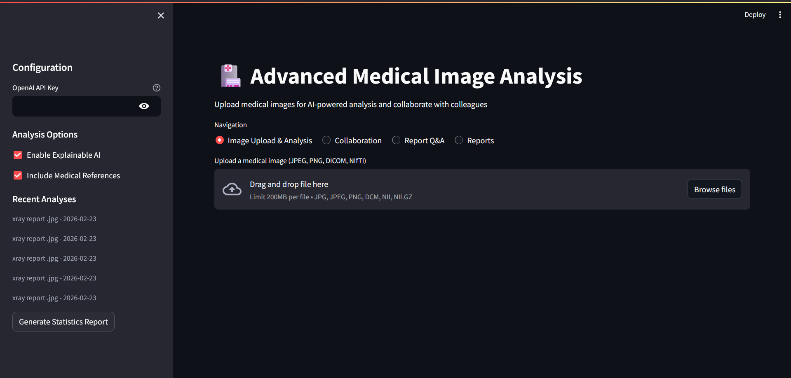
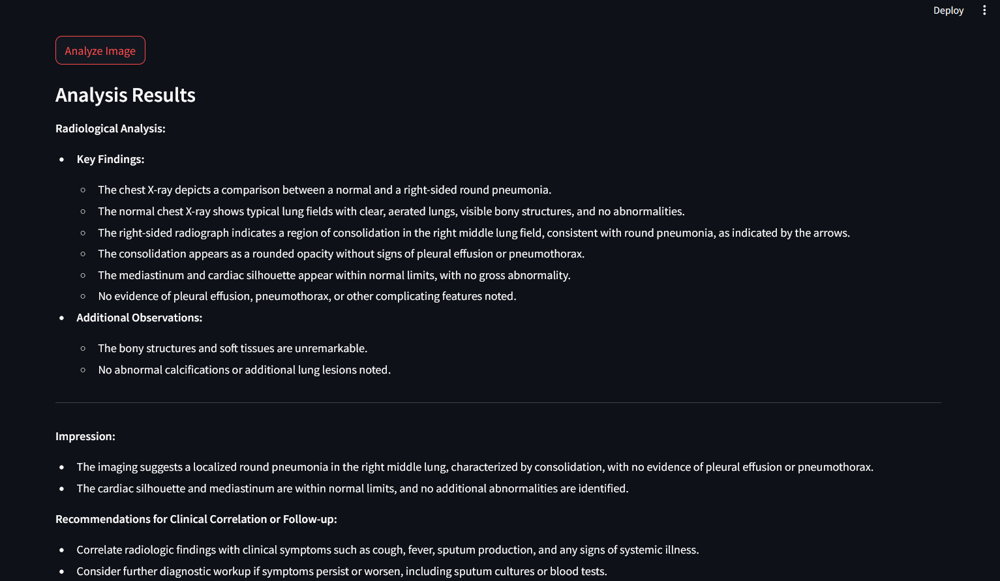
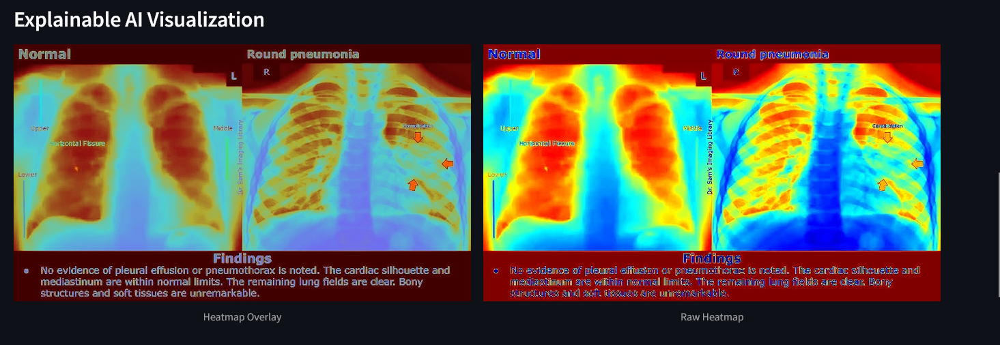
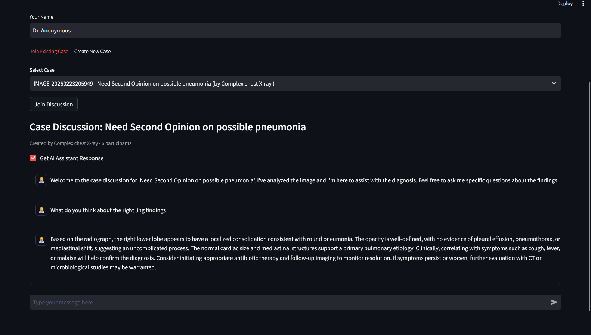
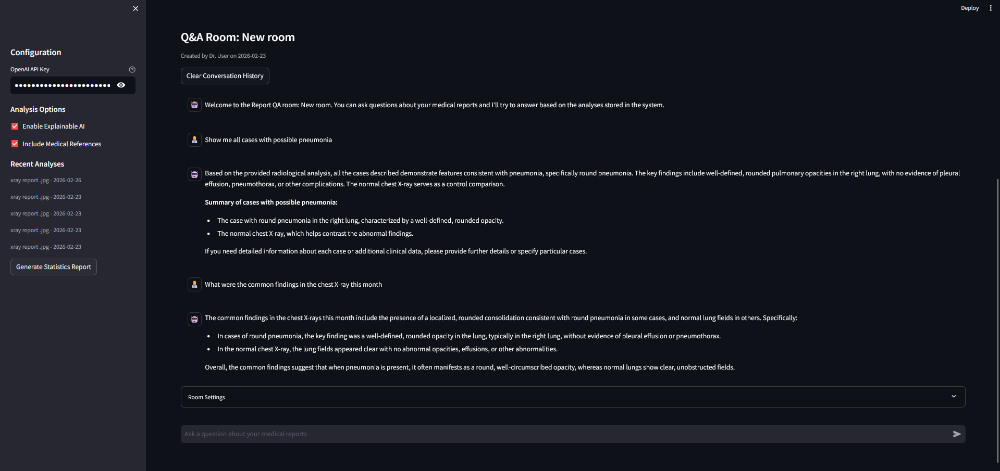
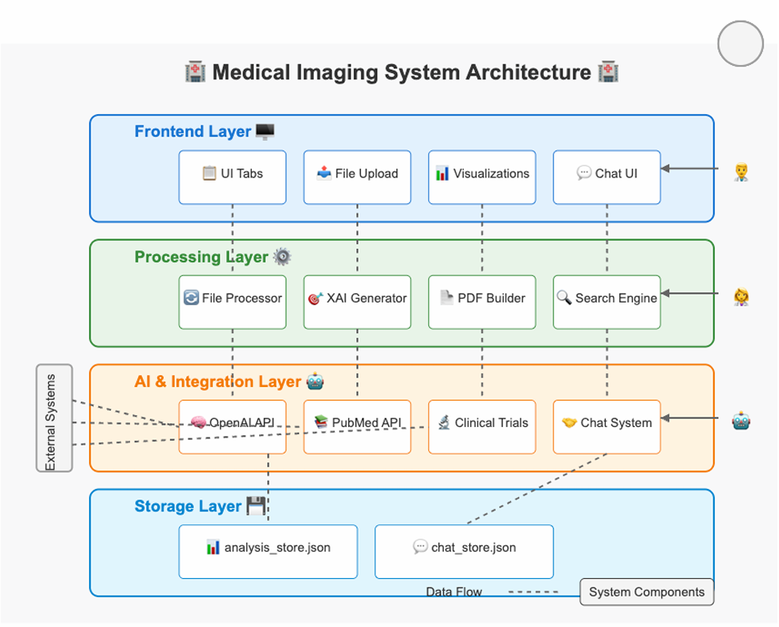
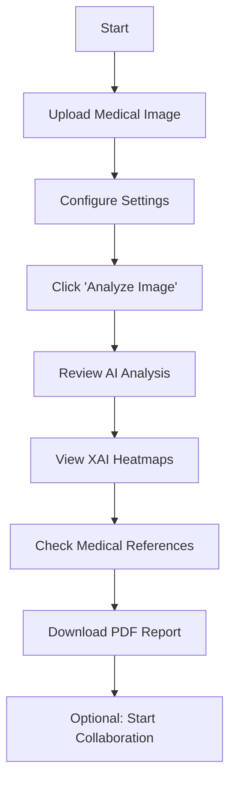
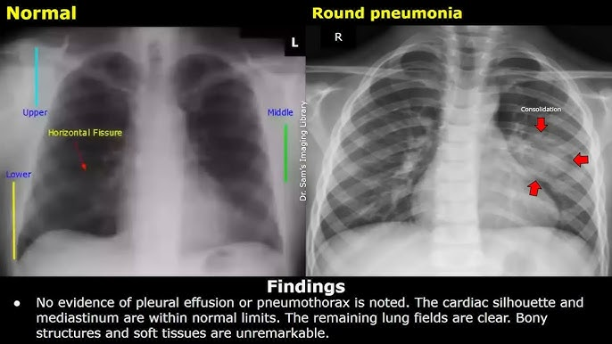

# 🏥 Medical Image Analysis Platform

<div align="center">



[](https://www.python.org/)
[](https://streamlit.io/)
[](https://openai.com/)
[](LICENSE)
[](https://iitj.ac.in/)

**An AI-powered platform for collaborative medical image analysis with explainable AI, knowledge integration, and real-time collaboration.**

[✨ Features](#-key-features) • [🎬 Demo](#-demo) • [📦 Installation](#-installation) • [📖 Usage](#-usage-guide) • [🏗 Architecture](#-system-architecture)

</div>

---

## 📋 Table of Contents

- [Overview](#-overview)
- [Key Features](#-key-features)
- [Demo](#-demo)
- [System Architecture](#-system-architecture)
- [Technology Stack](#-technology-stack)
- [Installation](#-installation)
- [Usage Guide](#-usage-guide)
- [Project Structure](#-project-structure)
- [Configuration](#-configuration)
- [Contributing](#-contributing)
- [Research](#-research--publications)
- [License](#-license)

---

## 🌟 Overview

The **Medical Image Analysis Platform** is a cutting-edge AI-powered system developed at **IIT Jodhpur** under **DRDO funding** to revolutionize medical image interpretation through artificial intelligence, explainability, and collaborative decision-making.

### 🎯 Mission

Enable healthcare professionals to leverage AI for:
- 🔬 **Enhanced Diagnosis**: AI-assisted medical image interpretation
- 🤝 **Collaboration**: Multi-specialist case discussions
- 📚 **Evidence-Based Medicine**: Automatic literature integration
- 🔍 **Transparency**: Explainable AI visualizations

### 🩺 Supported Medical Formats

<table>
<tr>
<td align="center" width="33%">

.dcm files
</td>
<td align="center" width="33%">
<br/>
<b>NIfTI</b><br/>
.nii, .nii.gz
</td>
<td align="center" width="33%">
<br/>
<b>Images</b><br/>
JPG, PNG
</td>
</tr>
</table>

---

## ✨ Key Features

### 🤖 AI-Powered Analysis


- **GPT-4o Vision Integration**: State-of-the-art medical image interpretation
- **Detailed Findings**: Systematic analysis of anatomical structures
- **Diagnostic Assessment**: Primary diagnosis with differential diagnoses
- **Clinical Recommendations**: Evidence-based next steps

### 🔍 Explainable AI (XAI) Visualization


- **Attention Heatmaps**: Visual explanation of AI decision-making
- **Region Highlighting**: Show which areas influenced the diagnosis
- **Overlay Visualization**: Side-by-side comparison views
- **Transparent Reasoning**: Understand *why* AI reached conclusions

### 👥 Multi-Doctor Collaboration


- **Real-Time Chat**: Instant messaging between specialists
- **Case Discussions**: Structured threads for complex cases
- **AI Assistant**: Simulated expert opinions and suggestions
- **Annotation Tools**: Mark regions of interest collaboratively

### 📚 Medical Knowledge Integration


- **PubMed Search**: Automatic literature retrieval
- **Clinical Trials**: Latest research and ongoing studies  
- **Evidence Citations**: Proper medical references
- **Real-Time Updates**: Most current research findings

### 📊 Professional Reporting


- **Structured Reports**: Professional medical documentation
- **Comprehensive Findings**: All key observations included
- **Literature References**: Cited research articles
- **Downloadable PDFs**: Export for medical records

### 🔎 Report Q&A System


- **RAG-Powered**: Retrieval-Augmented Generation
- **Semantic Search**: Find relevant information intelligently
- **Natural Language**: Ask questions conversationally
- **Context-Aware**: Understands medical terminology

---

## 🎬 Demo

### System Workflow

<div align="center">



</div>

### Screenshot Gallery

<details open>
<summary><b>📸 Click to view screenshots</b></summary>

#### Main Interface


#### Analysis Results


#### XAI Heatmaps


#### Collaboration Chat


#### Q&A System


</details>

---

## 🏗 System Architecture

### High-Level Architecture



**Replace with your uploaded diagrams:**
- System Architecture (Image 1)
- Data Flow (Image 2)  
- Components (Image 3)
- Layered Architecture (Image 4)

### Architecture Layers

```
┌────────────────────────────────────────────┐
│         Frontend Layer 🖥️                  │
│   Streamlit UI • File Upload • Charts     │
└──────────────┬─────────────────────────────┘
               │
┌──────────────▼─────────────────────────────┐
│       Processing Layer ⚙️                  │
│   File Processor • XAI • PDF Builder      │
└──────────────┬─────────────────────────────┘
               │
┌──────────────▼─────────────────────────────┐
│    AI & Integration Layer 🤖               │
│   OpenAI • PubMed • Chat System           │
└──────────────┬─────────────────────────────┘
               │
┌──────────────▼─────────────────────────────┐
│         Storage Layer 💾                   │
│   JSON Files • Analysis Store • Chats     │
└────────────────────────────────────────────┘
```

### Data Flow

1. **📤 Upload** → Doctor uploads medical image
2. **🔄 Process** → Format-specific handling (DICOM/NIfTI/JPG)
3. **🧠 Analyze** → OpenAI GPT-4o performs vision analysis
4. **📊 Visualize** → Generate XAI heatmaps and results
5. **📚 Augment** → Fetch relevant medical literature
6. **💬 Collaborate** → Enable multi-doctor discussions
7. **📄 Document** → Generate professional PDF reports
8. **💾 Archive** → Store for future retrieval and Q&A

---

## 🛠 Technology Stack

### Core Technologies

<table align="center">
<tr>
<td align="center" width="20%">
<br/>
<b>Python 3.8+</b>
</td>
<td align="center" width="20%">
<br/>
<b>Streamlit</b>
</td>
<td align="center" width="20%">
<br/>
<b>OpenAI</b>
</td>
<td align="center" width="20%">
<br/>
<b>OpenCV</b>
</td>
<td align="center" width="20%">
<br/>
<b>NumPy</b>
</td>
</tr>
</table>

### Complete Stack

| Layer | Technologies |
|-------|-------------|
| **Frontend** |  |
| **Backend** |   |
| **AI/ML** |   |
| **Imaging** |    |
| **Docs** |  |
| **APIs** |  |

---

## 📦 Installation

### Prerequisites

```bash
✅ Python 3.8 or higher
✅ pip package manager  
✅ OpenAI API key (from platform.openai.com)
✅ 4GB+ RAM recommended
✅ Internet connection (for API calls)
```

### Quick Start (3 steps)

```bash
# 1️⃣ Clone repository
git clone https://github.com/YOUR_USERNAME/medical-imaging-diagnosis.git
cd medical-imaging-diagnosis

# 2️⃣ Install dependencies
pip install -r requirements.txt

# 3️⃣ Run application
streamlit run app.py
```

### Detailed Setup

<details>
<summary><b>🐍 Using Virtual Environment (Recommended)</b></summary>

```bash
# Create virtual environment
python -m venv venv

# Activate it
# Windows:
venv\Scripts\activate
# macOS/Linux:
source venv/bin/activate

# Install dependencies
pip install -r requirements.txt

# Run app
streamlit run app.py
```
</details>

<details>
<summary><b>🐍 Using Conda</b></summary>

```bash
# Create conda environment
conda create -n medai python=3.9 -y
conda activate medai

# Install dependencies
pip install -r requirements.txt

# Run app
streamlit run app.py
```
</details>

<details>
<summary><b>🐳 Using Docker (Advanced)</b></summary>

```bash
# Build image
docker build -t medical-imaging-ai .

# Run container
docker run -p 8501:8501 medical-imaging-ai

# Access at http://localhost:8501
```
</details>

### ⚙️ First-Time Configuration

1. **Launch app**: Browser opens to `http://localhost:8501`
2. **Enter API key**: Sidebar → "OpenAI API Key" field
3. **Toggle features**: Enable XAI, References as needed
4. **Upload image**: Start analyzing!

---

## 📖 Usage Guide

### 🚀 Quick Workflow



### Step-by-Step Guide

#### 1️⃣ Upload Medical Image

<table>
<tr>
<td width="50%">

**Supported Formats:**
- 🩻 DICOM (.dcm)
- 🧠 NIfTI (.nii, .nii.gz)
- 📷 Images (.jpg, .png)

**How to Upload:**
1. Click "Browse files" button
2. Select medical image file
3. Image preview appears automatically

</td>
<td width="50%">



</td>
</tr>
</table>

#### 2️⃣ Configure Analysis Options

In the sidebar, toggle:
- ✅ **Enable Explainable AI** - Generate heatmaps
- ✅ **Include Medical References** - Fetch PubMed articles

#### 3️⃣ Analyze Image

Click the **"Analyze Image"** button and wait 3-5 seconds.

**Analysis includes:**
- 📋 Radiological findings
- 🎯 Diagnostic assessment
- 💡 Clinical recommendations
- 🔍 XAI visualization
- 📚 Medical literature

#### 4️⃣ Generate Professional Report

Click **"Download PDF Report"** to get:
- Structured findings summary
- Key observations numbered list
- Medical literature citations
- Timestamp and metadata

#### 5️⃣ Collaborate with Colleagues

Navigate to **"Collaboration"** tab:
1. Create new case discussion
2. Enter case description  
3. Chat in real-time with AI assistant
4. Invite other specialists
5. Share insights and annotations

#### 6️⃣ Ask Questions (Q&A System)

Navigate to **"Report Q&A"** tab:
1. Create or join Q&A room
2. Ask natural language questions
3. AI retrieves relevant context from past analyses
4. Get instant answers with sources

### Advanced Features

<details>
<summary><b>🔧 Custom AI Prompts</b></summary>

Edit `prompts.py` to customize AI behavior:

```python
ANALYSIS_PROMPT = """
As an expert radiologist, analyze this medical image.

Provide:
1. Image type and quality assessment
2. Systematic findings
3. Diagnostic impression
4. Clinical recommendations

[Your custom instructions here]
"""
```
</details>

<details>
<summary><b>⚡ Batch Processing</b></summary>

Process multiple images programmatically:

```python
from utils_simple import analyze_image, process_file

images = ["xray1.jpg", "ct_scan.dcm", "mri.nii"]

for img_path in images:
    file_data = process_file(img_path)
    results = analyze_image(file_data["data"], api_key)
    print(f"Analysis for {img_path}:")
    print(results["analysis"])
```
</details>

---

## 📁 Project Structure

```
medical-imaging-diagnosis/
│
├── 📄 app.py                           # Main Streamlit application
├── 🔧 utils_simple.py                  # Core utilities (processing, AI)
├── 💬 chat_system.py                   # Multi-doctor collaboration
├── 🤔 report_qa_chat.py                # RAG-based Q&A system
├── 🖼️ qa_interface.py                   # Q&A user interface
├── 📝 prompts.py                       # AI prompt templates
│
├── 📋 requirements.txt                 # Python dependencies
├── 📖 README.md                        # This documentation
├── ⚖️ LICENSE                          # MIT License
│
├── 📚 docs/                            # Documentation
│   ├── architecture/                  # System diagrams
│   ├── screenshots/                   # UI screenshots
│   └── images/                        # Assets
│
├── 💾 data/                            # Data storage (gitignored)
│   ├── analysis_store.json            # Analysis archives
│   └── chat_store.json                # Chat histories
│
└── 🧪 tests/                           # Unit tests
    ├── test_image_processing.py
    ├── test_ai_analysis.py
    └── test_collaboration.py
```

---

## ⚙️ Configuration

### Environment Variables (Optional)

Create `.env` file:

```bash
OPENAI_API_KEY=sk-your-api-key-here
OPENAI_BASE_URL=https://api.openai.com/v1  # Optional custom endpoint
PUBMED_EMAIL=your.email@example.com        # For PubMed API
```

### Sidebar Settings

| Setting | Description | Default |
|---------|-------------|---------|
| **OpenAI API Key** | Your GPT-4o API key | *Required* |
| **Enable XAI** | Show explainable AI heatmaps | ✅ On |
| **Include References** | Fetch PubMed literature | ✅ On |

### Model Configuration

In `utils_simple.py`, you can modify:

```python
# AI models to try (in order)
models_to_try = [
    "gpt-4o-mini",      # Fastest, cheapest (~$0.001/image)
    "gpt-4o",           # Best quality (~$0.01/image)
    "gpt-4-turbo"       # Alternative
]
```

---

## 🤝 Contributing

Contributions are welcome! Here's how you can help:

### Ways to Contribute

- 🐛 **Report Bugs**: [Open an issue](https://github.com/YOUR_USERNAME/medical-imaging-diagnosis/issues)
- ✨ **Suggest Features**: Share your ideas!
- 📝 **Improve Docs**: Fix typos, add examples
- 🧪 **Add Tests**: Increase code coverage
- 🎨 **Enhance UI**: Make it more user-friendly

### Development Workflow

```bash
# 1. Fork the repo on GitHub

# 2. Clone your fork
git clone https://github.com/YOUR_USERNAME/medical-imaging-diagnosis.git

# 3. Create feature branch
git checkout -b feature/amazing-feature

# 4. Make changes and commit
git commit -m "Add amazing feature"

# 5. Push to your fork
git push origin feature/amazing-feature

# 6. Open Pull Request on GitHub
```


## 📄 License

This project is licensed under the **MIT License** - see [LICENSE](LICENSE) for details.

```
MIT License

Copyright (c) 2025 Akash Chatterjee

Permission is hereby granted, free of charge, to any person obtaining a copy
of this software and associated documentation files (the "Software"), to deal
in the Software without restriction, including without limitation the rights
to use, copy, modify, merge, publish, distribute, sublicense, and/or sell
copies of the Software...
```

---

## 🙏 Acknowledgments

### Technology Partners

- **OpenAI** - GPT-4o Vision API
- **Streamlit** - Web framework
- **NCBI** - PubMed API access

### Special Thanks

- Medical professionals for domain expertise and testing
- Open-source community for excellent libraries
- Beta testers for valuable feedback
- Claude AI (Anthropic) for development assistance

---

## 📞 Contact

<div align="center">

### 👨‍💻 Developer

**Akash Chatterjee**  
M.Tech Student, IIT Jodhpur  
Junior Research Fellow, DRDO Project

[](mailto:chatterjeeakash887@gmail.com)
[](https://linkedin.com/in/YOUR_PROFILE)
[](https://github.com/YOUR_USERNAME)

### 🏛️ Institution

**Indian Institute of Technology Jodhpur**  
Department of Computer Science & Engineering  


</div>

---

## ⚠️ Disclaimer

**IMPORTANT NOTICE**

This software is intended for **research and educational purposes only**.

- ⚠️ **NOT FDA APPROVED** for clinical use
- ⚠️ **NOT A MEDICAL DEVICE** under regulatory definitions
- ⚠️ **NOT A REPLACEMENT** for professional medical diagnosis
- ✅ **INTENDED AS** a decision support tool for research
- ✅ **FOR EDUCATIONAL** demonstrations and academic use
- ✅ **FOR DEVELOPMENT** of medical AI systems

**All medical decisions must be made by qualified healthcare professionals based on comprehensive clinical evaluation. This tool provides AI-assisted insights only.**

---

## 🗺️ Roadmap

### ✅ Current Version: v1.0.0

- Multi-format image support (DICOM, NIfTI, JPG/PNG)
- GPT-4o vision analysis
- Explainable AI heatmaps
- Multi-doctor collaboration
- PDF report generation
- RAG-based Q&A system

### 🚀 Upcoming Features

#### v1.1.0 (Q2 2025)
- [ ] 3D visualization for CT/MRI volumes
- [ ] Enhanced XAI with Grad-CAM
- [ ] Video support (ultrasound sequences)
- [ ] Multi-language interface

#### v1.2.0 (Q3 2025)
- [ ] PACS integration
- [ ] Mobile app (iOS/Android)
- [ ] Offline mode
- [ ] Real-time video collaboration

#### v2.0.0 (Q4 2025)
- [ ] Fine-tuned medical imaging models
- [ ] Clinical decision support system
- [ ] EHR system integration
- [ ] Regulatory compliance (FDA, CE)

---

## 📊 Performance Metrics

### Analysis Speed

| Image Type | Processing | AI Analysis | Total Time |
|-----------|-----------|-------------|-----------|
| JPG/PNG | <1s | 3-5s | **~5s** |
| DICOM | 1-2s | 3-5s | **~6s** |
| NIfTI | 2-3s | 3-5s | **~7s** |

### API Costs (OpenAI)

| Model | Cost per Image | 100 Images |
|-------|---------------|-----------|
| gpt-4o-mini | $0.001 | $0.10 |
| gpt-4o | $0.010 | $1.00 |

---

<div align="center">

## ⭐ Star This Repository

If you find this project useful, please give it a star!

[](https://github.com/YOUR_USERNAME/medical-imaging-diagnosis/stargazers)

---

**Built with ❤️ at IIT Jodhpur **

Made by [Akash Chatterjee](https://github.com/YOUR_USERNAME)

[⬆ Back to Top](#-medical-image-analysis-platform)

</div>
